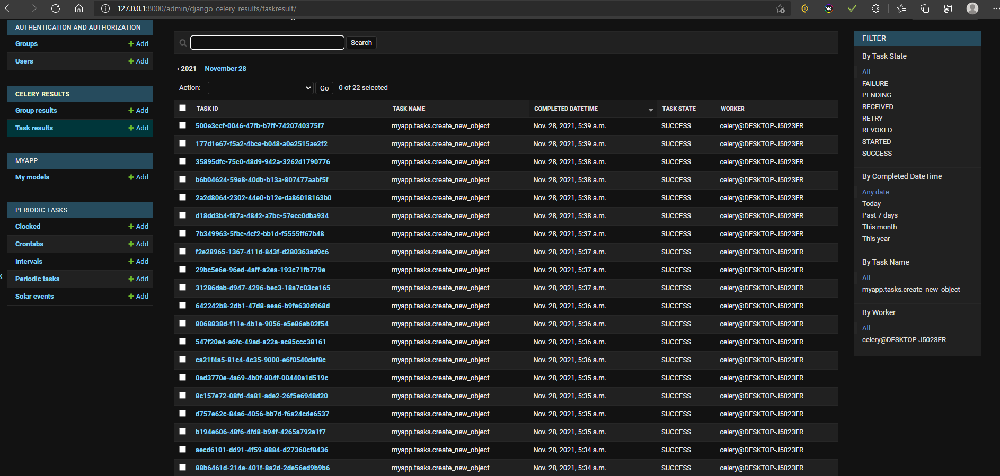

Тестовый django проект с использованием фреймворка Celery + Redis
(Redis запускал через docker)

Использовал: celery, django-celery-beat, django-celery results

Задача: каждые 15 секунд создавать рандомные имена

Реализация:
